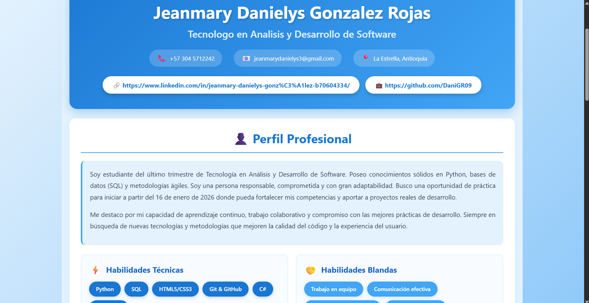

# CV React - Jeanmary Danielys Gonzalez Rojas

## Descripción del Proyecto
Este proyecto es una hoja de vida (CV) interactiva desarrollada con React, implementando componentes modulares y anidados.

## Captura de Pantalla


## Tecnologías Utilizadas
- React 18
- Vite
- JavaScript (ES6+)
- CSS3

## Componentes Principales
- **CabeceraCV**: Información personal y de contacto
- **Perfil**: Descripción profesional y habilidades
- **Experiencia**: Historial laboral y proyectos
- **Educacion**: Formación académica y cursos

## Instrucciones para Ejecutar el Proyecto


### Prerrequisitos
- Node.js (versión 16 o superior)
- npm o yarn

### Instalación

1. Clonar el repositorio:
```bash
git clone https://github.com/DaniGR09/cv-react-jeanmary-gonzalez
```

2. Navegar al directorio del proyecto:
```bash
cd cv-react-jeanmary-gonzalez
```

3. Instalar dependencias:
```bash
npm install
```

4. Ejecutar el proyecto:
```bash
npm run dev
```

5. Abrir en el navegador:
```
http://localhost:5173
```

## Autor
Jeanmary Gonzalez - Tecnólogo en Análisis y Desarrollo de Software - SENA
